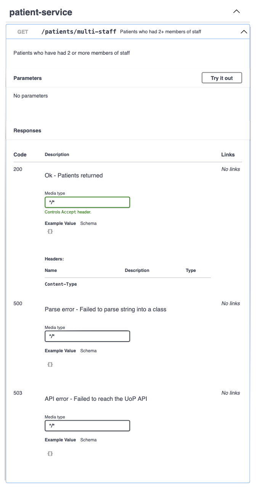
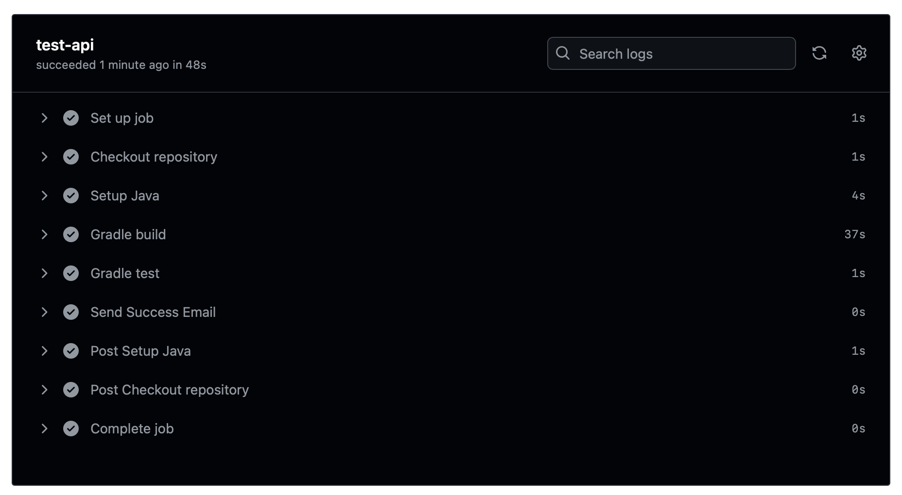

# COMP2005 Report

This is my COMP2005 report, in this you will find the [report](./report.md)
which will have the link for pretty much everything in it, you will also find
the source code for both the [API](./part-a-web-service-api) and the [App](./part-b-frontend-app).

## Quick Links

- [Report (.md)](./report.md)
- [Report (.pdf)](./report.pdf)
- [API Source Code](./part-a-web-service-api)
- [App Source Code](./part-b-frontend-app)
- [Insomnia API Definition](./insomnia-endpoints.yml)

## Screenshots

### Swagger GUI

### API GitHub Action

