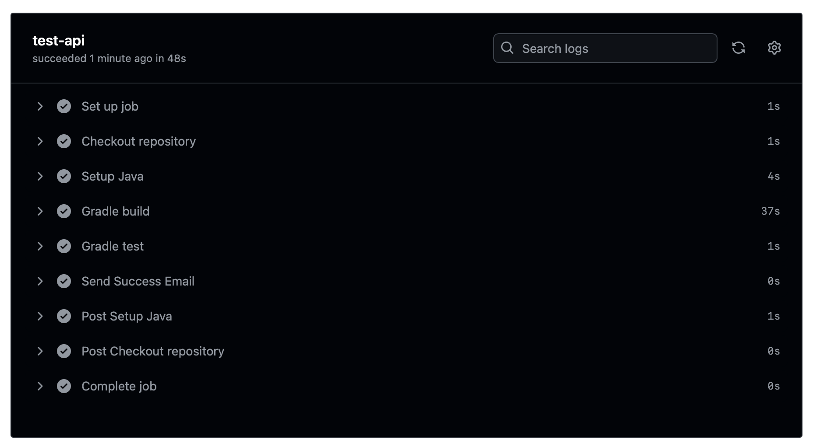

# 2005 Report

GitHub Repo: [https://github.com/bobbymannino/comp2005-report](https://github.com/bobbymannino/comp2005-report)

<!-- TODO add youtube video -->

YouTube Video: [http://youtu.be](https://youtu.be)

## Test Plan

I have been tasked with creating an API that interacts with a predefined API,
and an application that interacts with my API. Along with this I need to test
(and document the tests) that everything works using multiple testing methods
including user acceptance testing.

The test plan has been created to communicate the approach I have taken to test
the software, as well as what is and is not in scope.

### Objectives

To deliver 2 products that have been tested, as well as the test documentation,
and a youtube video.

### Scope

The scope is ignore any problems on the hosted API, if the API returns malformed
data it is not my job to parse through it and fix it, I expect the data to be as
presented.

What is in scope though is user testing, I must get user feedback on
the app and make changes accordingly.

### Test Approach

For both the API and app, I have created unit tests, integration tests and
system tests. For the app I have also tested the user acceptance. I will do this
via a [JISC](https://www.jisc.ac.uk/) survey.

#### API Testing

The approach I took for implementing the API was test driven development. I
chose this because it is nice to know how well your code is working before you
get to the end (like washing up as you go).

I have added unit tests for classes such as `AdmissionClass` like so:

```java
@Test
void createAdmissionClass() {
    AdmissionClass admission = new AdmissionClass(1, "1979-12-22T15:00:00", null, 12);

    assertEquals(1, admission.id);
    assertEquals(12, admission.patientID);
    assertEquals("1979-12-22T15:00:00", admission.admissionDate);
    assertNull(admission.dischargeDate);
    assertEquals(11, admission.getAdmissionDateParsed().get(Calendar.MONTH));
    assertEquals(1979, admission.getAdmissionDateParsed().get(Calendar.YEAR));
    assertNull(admission.getDischargeDateParsed());
}
```

These tests ensure that given the correct data in, you _should_ get the expected
output. Throughout this document I will give examples, I have more tests then
the examples.

In this API I found early on that I needed to work with dates a lot, so I
abstracted that out into its own class. Without a unit I cannot unit test. Doing
this enabled 2 things, one is I can unit test it like so:

```java
@Test
void changeDate() {
    String dateString = "1979-12-22T15:00:00";

    Calendar cal = DateFormatter.parseDate(dateString);

    assertEquals(11, cal.get(Calendar.MONTH));
    assertEquals(1979, cal.get(Calendar.YEAR));
    assertEquals(22, cal.get(Calendar.DAY_OF_MONTH));
    assertEquals(15, cal.get(Calendar.HOUR_OF_DAY));

    cal.set(Calendar.DAY_OF_MONTH, 26);
    cal.set(Calendar.YEAR, 2011);
    cal.set(Calendar.MONTH, 2);

    String dateString2 = "2011-03-26T15:00:00";

    Calendar cal2 = DateFormatter.parseDate(dateString2);

    cal.equals(cal2);
}
```

This ensures that `DateFormatter` on its own works, but to test `AdmissionClass`
and `DateFormatter` together, I need integration tests. Through my unit tests I
have levered the AAA (arrange, act, assert) testing convention. An example of
integration testing between `AdmissionClass` and `DateFormatter`:

```java
@Test
void admissionClassWithDateParser() {
    AdmissionClass admission = new AdmissionClass(1, "1979-12-22T15:00:00", null, 1);

    Calendar admissionDate = DateFormatter.parseDate(admission.admissionDate);

    assertEquals(admissionDate.get(Calendar.YEAR), 1979);
    assertEquals(admissionDate.get(Calendar.MONTH), 11);
    assertEquals(admissionDate.get(Calendar.DAY_OF_MONTH), 22);
}
```

Me and Mr. Dixon spoke about wether to return object responses (all details
about a patient) or just a patient ID for the in-admitted patients endpoint, we
agreed that as long as i'm consistent across the entire project it doesn't
matter. From there that gave me the idea to be consistent across all endpoints
for the type of data I return. I ended up deciding that no matter what is
returned, error or success, it must conform to `ResponseEntity<ObjectNode>`.
This made working with the API from the app 10x easier.

```json
{
	"status": 500,
	"message": "The data returned from the API is malformed, please try again later."
}
```

Any errors that occur that will all return an object with the status and a
message to help the user understand the error.

What about when things go wrong? Well I looked to HCI's best practices and found
[Jakob Nielsen's 10 Usability
Heuristics](https://www.nngroup.com/articles/ten-usability-heuristics), #9
talks about not error prevention but recognition and more importantly diagnosis.
In order to help the user diagnose an error if something does go wrong, I have
made sure that all errors return the correct code and a helpful message about
what the error was.

There was some manual endpoint testing which I executed using
[Insomnia](https://insomnia.rest/), this was helpful for quickly/repeatedly
getting a status from an endpoint (e.g. 200, 500), but also seeing the response
formatted. the yaml file is [here](./insomnia-endpoints.yml).

I have added some more suitable system testing to each endpoint via `MockMvc`.
They all look something similar to this:

```java
@Test
void testGetMostAdmissionsMonth() throws Exception {
    // arrange
    MockHttpServletRequestBuilder req = MockMvcRequestBuilders.get("/admissions/most").accept(MediaType.APPLICATION_JSON);
    String reg = "^\\{\"busiestMonth\":\"\\w{3,}\",\"admissions\":\\d+}$";

    // act
    MvcResult res = mockMvc.perform(req).andReturn();
    String resContent = res.getResponse().getContentAsString();

    // assert
    assertEquals(200, res.getResponse().getStatus());
    assertNotNull(resContent);
    assertTrue(resContent.matches(reg));
}
```

Using `MockMvc` allows me to test each endpoint without having to start up the
HTTP server, this saves me time and the computer resources. They all conform to
AAA as well as using regex to check the response body is as it should be. Regex
allows me to be super precise with what to expect.

Throughout testing I remembered to think about edge and corner cases, so after I
had made some progress I extract the logic for determining wether a patient has
been readmitted within 7 days into its own function so I could test it. This
allowed me to created edge cases where the exact second was 7 days on the nose.
I could then make sure it behaved the way I would like, in this case allowing
that as true. Other edge cases I tested include: in by one second, out by one
second.

```java
@Test
void testEdgeCaseWithin7Days() {
    // arrange
    AdmissionClass admission1 = new AdmissionClass(1, "1979-12-22T15:00:00", "1979-12-22T15:00:00", 1);
    AdmissionClass admission2 = new AdmissionClass(2, "1979-12-29T15:00:00", null, 1);

    List<AdmissionClass> admissions = new ArrayList<>();
    admissions.add(admission1);
    admissions.add(admission2);

    // act
    boolean isReadmittedWithin7Days = AdmissionUtils.isPatientReadmittedWithin7Days(admissions);

    // assert
    assertTrue(isReadmittedWithin7Days);
}
```

Refactoring the code for this logic actually ended up saving me how much code
was executed and simplified the logic by a lot. I like it when my code is easily
understandable. Whilst refactoring I did come across some edge cases where it
would round the difference up, so it was a good job I tested it!

The API endpoints if you would like to test there are here:

- [Patients with multiple staff](http://localhost:8080/patients/multi-staff)
- [Readmitted patients within 7 days of release](http://localhost:8080/admissions/re)
- [Patients who have never been admitted](http://localhost:8080/admissions/never)
- [Month with the most admissions](http://localhost:8080/admissions/most)

#### App Testing

---

**APP TO DO LIST**

- [ ] (write) fallback patient name (hci)
- [ ] (code, write) get a loading state in there, how does the user know its loading?
- [ ] (do, write) make UAT questionnaire thing
- [ ] (do, write) perform UAT test
- [ ] (code, write) make changes based on UAT results
- [ ] (do and write) code coverage
- [ ] (code, write) rite about unit tests
- [ ] (code, write) rite about integration tests
- [ ] (code, write) rite about system tests

---

#### Automation

I have enabled automatic testing via GitHub actions. This way they can be tested
without me having to manually go in and test it. I also set it up to send an
email to whoever pushed the last commit if the tests passed. Here is the yaml
file for testing the API:

```yml
name: Test Java API
run-name: ${{ github.actor }}, lets hope this works!

on:
  push:
    branches: ["main"]
  pull_request:
    branches: ["main"]

jobs:
  test-api:
    runs-on: ubuntu-latest
    permissions:
      contents: read
    steps:
      - name: "Checkout repository"
        uses: actions/checkout@v4
      - name: Setup Java
        uses: actions/setup-java@v4
        with:
          distribution: "temurin"
          java-version: "23"
      - name: "Gradle build"
        run: |
          cd api
          ./gradlew build
      - name: "Gradle test"
        run: |
          cd api
          ./gradlew test
      - name: "Send Success Email"
        run: |
          curl -X POST https://plunk.bobman.dev/api/v1/send \
            -H 'Content-Type: application/json' \
            -H 'Authorization: Bearer ${{ secrets.PLUNK_API_KEY }}' \
            -d '{ \
                "to": "${{ github.event.commits[0].author.email }}", \
                "subject":"Well Done!" \
                "body": "API test passed, committed by ${{ github.actor }}", \
            }'
```

And here is a screenshot of the pipeline succeeding on GitHub:



### Evaluation

- why i have tested it the way i have

---

## TODO

### Demo

- [ ] API
- [ ] App
- [ ] Tests

### Docs

- [ ] Write report
  - [ ] Intro
  - [ ] Test plan
  - [ ] Table of test types and examples
  - [ ] Instructions on how to run tests/programs
  - [ ] Evaluation
- [ ] YouTube video

## Notes

- use [JISC](https://onlinesurverys.ac.uk) for questionnaires
- mention static testing (linters) and dynamic (unit, etc...)
- box testing (black, gray, white)
- code coverage
- edge/corner cases
- unit -> integration -> system -> usability
  - system testing: make sure its as close to real use case as possible
    (environment)
- mention about the port, what if it is in use?
- handle error if service is down, what to show user?

### Cognitive walkthrough

1. is the user on the right track
2. is step visible (next action)
3. is it labeled well
4. feedback

### Test Plan

- objective of test
- scope of test, what is to be included/not
- how long should the test last (in seconds/minutes)
- what type of test is it
- manual/automatic (github actions)
- environment? is it mac, windows, browser, chrome, webkit?
- assumptions
- notes
- measure speed?
  - if stress testing, how much slower does it get?
