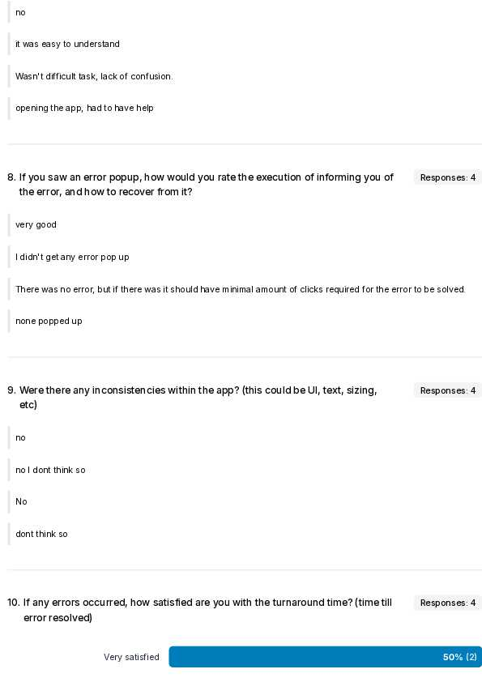
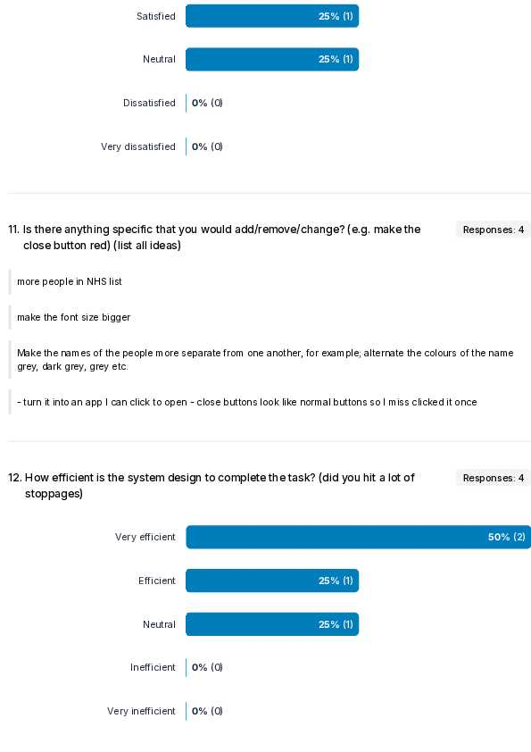

# 2005 Report

GitHub Repo: [https://github.com/Plymouth-University/comp2005-assessment2-bobbymannino](https://github.com/Plymouth-University/comp2005-assessment2-bobbymannino)

YouTube Video: [https://youtu.be/fkzyoxktT6E](https://youtu.be/fkzyoxktT6E)

<small>I did the video before I made changes based on the UAT</small>

## Test Plan

I have been tasked with creating an API that interacts with a predefined API,
and an application that interacts with my API. Along with this I need to test
(and document the tests) that everything works using multiple testing methods
including user acceptance testing.

The test plan has been created to communicate the approach I have taken to test
the software, as well as what is and is not in scope.

### Objectives

To deliver 2 products that have been tested, as well as the test documentation,
and a youtube video.

### Scope

The scope is ignore any problems on the hosted API, if the API returns malformed
data it is not my job to parse through it and fix it, I expect the data to be as
presented.

What is in scope though is user testing, I must get user feedback on
the app and make changes accordingly.

### Test Approach

For both the API and app, I have created unit tests, integration tests and
system tests. For the app I have also tested the user acceptance. I will do
this via a [JISC](https://www.jisc.ac.uk/) survey (more info later on).

#### API Testing

The approach I took for implementing the API was test driven development. I
chose this because it is nice to know how well your code is working before you
get to the end (like washing up as you go).

I have added unit tests for classes such as `AdmissionClass` like so:

```java
@Test
void createAdmissionClass() {
    AdmissionClass admission = new AdmissionClass(1, "1979-12-22T15:00:00", null, 12);

    assertEquals(1, admission.id);
    assertEquals(12, admission.patientID);
    assertEquals("1979-12-22T15:00:00", admission.admissionDate);
    assertNull(admission.dischargeDate);
    assertEquals(11, admission.getAdmissionDateParsed().get(Calendar.MONTH));
    assertEquals(1979, admission.getAdmissionDateParsed().get(Calendar.YEAR));
    assertNull(admission.getDischargeDateParsed());
}
```

These tests ensure that given the correct data in, you _should_ get the expected
output. Throughout this document I will give examples, I have more tests then
the examples.

In this API I found early on that I needed to work with dates a lot, so I
abstracted that out into its own class. Without a unit I cannot unit test. Doing
this enabled 2 things, one is I can unit test it like so:

```java
@Test
void changeDate() {
    String dateString = "1979-12-22T15:00:00";

    Calendar cal = DateFormatter.parseDate(dateString);

    assertEquals(11, cal.get(Calendar.MONTH));
    assertEquals(1979, cal.get(Calendar.YEAR));
    assertEquals(22, cal.get(Calendar.DAY_OF_MONTH));
    assertEquals(15, cal.get(Calendar.HOUR_OF_DAY));

    cal.set(Calendar.DAY_OF_MONTH, 26);
    cal.set(Calendar.YEAR, 2011);
    cal.set(Calendar.MONTH, 2);

    String dateString2 = "2011-03-26T15:00:00";

    Calendar cal2 = DateFormatter.parseDate(dateString2);

    cal.equals(cal2);
}
```

This ensures that `DateFormatter` on its own works, but to test `AdmissionClass`
and `DateFormatter` together, I need integration tests. Through my unit tests I
have levered the AAA (arrange, act, assert) testing convention. An example of
integration testing between `AdmissionClass` and `DateFormatter`:

```java
@Test
void admissionClassWithDateParser() {
    AdmissionClass admission = new AdmissionClass(1, "1979-12-22T15:00:00", null, 1);

    Calendar admissionDate = DateFormatter.parseDate(admission.admissionDate);

    assertEquals(admissionDate.get(Calendar.YEAR), 1979);
    assertEquals(admissionDate.get(Calendar.MONTH), 11);
    assertEquals(admissionDate.get(Calendar.DAY_OF_MONTH), 22);
}
```

Me and Mr. Dixon spoke about wether to return object responses (all details
about a patient) or just a patient ID for the in-admitted patients endpoint, we
agreed that as long as i'm consistent across the entire project it doesn't
matter. From there that gave me the idea to be consistent across all endpoints
for the type of data I return. I ended up deciding that no matter what is
returned, error or success, it must conform to `ResponseEntity<ObjectNode>`.
This made working with the API from the app 10x easier.

```json
{
  "status": 500,
  "message": "The data returned from the API is malformed, please try again later."
}
```

Any errors that occur that will all return an object with the status and a
message to help the user understand the error.

What about when things go wrong? Well I looked to HCI's best practices and found
[Jakob Nielsen's 10 Usability
Heuristics](https://www.nngroup.com/articles/ten-usability-heuristics), #9
talks about not error prevention but recognition and more importantly diagnosis.
In order to help the user diagnose an error if something does go wrong, I have
made sure that all errors return the correct code and a helpful message about
what the error was.

There was some manual endpoint testing which I executed using
[Insomnia](https://insomnia.rest/), this was helpful for quickly/repeatedly
getting a status from an endpoint (e.g. 200, 500), but also seeing the response
formatted. the yaml file is [here](./insomnia-endpoints.yml).

I have added some more suitable system testing to each endpoint via `MockMvc`.
They all look something similar to this:

```java
@Test
void testGetMostAdmissionsMonth() throws Exception {
    // arrange
    MockHttpServletRequestBuilder req = MockMvcRequestBuilders.get("/admissions/most").accept(MediaType.APPLICATION_JSON);
    String reg = "^\\{\"busiestMonth\":\"\\w{3,}\",\"admissions\":\\d+}$";

    // act
    MvcResult res = mockMvc.perform(req).andReturn();
    String resContent = res.getResponse().getContentAsString();

    // assert
    assertEquals(200, res.getResponse().getStatus());
    assertNotNull(resContent);
    assertTrue(resContent.matches(reg));
}
```

Using `MockMvc` allows me to test each endpoint without having to start up the
HTTP server, this saves me time and the computer resources. They all conform to
AAA as well as using regex to check the response body is as it should be. Regex
allows me to be super precise with what to expect.

Throughout testing I remembered to think about edge and corner cases, so after I
had made some progress I extract the logic for determining wether a patient has
been readmitted within 7 days into its own function so I could test it. This
allowed me to created edge cases where the exact second was 7 days on the nose.
I could then make sure it behaved the way I would like, in this case allowing
that as true. Other edge cases I tested include: in by one second, out by one
second.

```java
@Test
void testEdgeCaseWithin7Days() {
    // arrange
    AdmissionClass admission1 = new AdmissionClass(1, "1979-12-22T15:00:00", "1979-12-22T15:00:00", 1);
    AdmissionClass admission2 = new AdmissionClass(2, "1979-12-29T15:00:00", null, 1);

    List<AdmissionClass> admissions = new ArrayList<>();
    admissions.add(admission1);
    admissions.add(admission2);

    // act
    boolean isReadmittedWithin7Days = AdmissionUtils.isPatientReadmittedWithin7Days(admissions);

    // assert
    assertTrue(isReadmittedWithin7Days);
}
```

Refactoring the code for this logic actually ended up saving me how much code
was executed and simplified the logic by a lot. I like it when my code is easily
understandable. Whilst refactoring I did come across some edge cases where it
would round the difference up, so it was a good job I tested it!

In case somebody new wanted to understand or even work on the API I have added
an OpenAPI generator plugin to my project. This way somebody can understand
the endpoints quickly which will save time and money in the long run. Here is a
screenshot of one of the endpoints:


A statistic that matters in test code coverage. This is the percent of your code
that has been put through a test, this could be measured by line, unit, classes,
files, and more. I used JaCoCo to get a report of how much of the code i've
written is tested when running the tests. This is good for resolving blindspots
and limiting production errors.


#### App Testing

I followed a similar thought process with the app as to the API which was a
test driven development approach. The app is quite simple. I was asked for it
to interact with one endpoint from my API and I chose the never admitted
patients route. The app contains 3 screens: main menu, never admitted
patients, and patient details (which interacts with the uni API).

The HCI principles is something that I have make sure to incoorperate and make
decisions based off, for instance when creating a `Patient` if there is no
`firstName` or `lastName` passed in (or blank strings) I will assign `UNKNOWN`
as that name, this way the user will see that they don't have a name. I would
put this under #10 which is help and documentation as it helps the user
understand this user does not have a name set.

I have a utility class `StringParser` which helps me take in a string and parse
it into a class. I tested this on its own but also with a `Patient` string, this
way I can test the name fallback and parser at once. I did a few tests so here's
an example:

```java
@Test
void testParsePatientStringWithFirstName() throws StringParseError {
    String raw = "{\"id\":1,\"nhsNumber\":\"1\",\"firstName\":\"bob\"}";

    Patient patient = StringParser.parse(raw, Patient.class);

    assertEquals(1, patient.id);
    assertEquals("bob", patient.firstName);
    assertEquals("UNKNOWN", patient.lastName);
    assertEquals("bob UNKNOWN", patient.getFullName());
    assertEquals("1", patient.nhsNumber);
}
```

What happens when something goes wrong? Well because it is a GUI we can show
the user visual elements to help them which complies with the 10 usability
heuristics' (10UH) 9th principle: help users recognize and recover from errors.

```java
public static void showError(String message, JPanel contentPane) {
    SwingUtilities.invokeLater(() -> {
        JOptionPane.showMessageDialog(contentPane, message, "Error!", JOptionPane.ERROR_MESSAGE);
    });
}
```

I created 3 severities of there: warning, error, and info. And when invoked I
would populate the message with something that would tell the user what has gone
wrong (e.g. "cannot connect to the uni API") and then something they could do to
help fix the error or how to contact support (e.g. "contact blah@icloud.com for
assistance").

A small thing I added across all screens was a close button at the bottom of the
page. This follows the 10UHs 4th rule: consistency and standards. By having a
close button on every page and in the same spot (which happens to be where most
close/cancel buttons are in software) really helps with keeping the user
comfortable and familiar with the UI.

Following Jakobs 1st principle we have show the user system status, keep them
aware of whats going on. So after the user clicks the button to open the window
there will be a loading state appear. This is useful because it shows the user
that something is happening which makes them more comfortable with waiting. It's
not a fabulous or pretty UI but it is functional enough that the user is aware
they are waiting while something is happening.

##### User Acceptance Testing

I have performed UAT testing on 4 different people. The questions were aimed at
3 things: efficacy of the app, UI/UX & error handling. There are some questions
about the UAT process but those are more for me then the app. The UAT gave me a
lot of valuable feedback on how to improve the app for the users. Some of the
changes I have made based on the feedback is as follows:

- Close button text "Close App" on main menu
- Close buttons text color now red
- Larger font size
- Alternating list row background color
- List row padding

I had the API running in the background already so the user doesn't have to
worry about it. I did also have somebody feedback that even to test the app
should be an exe instead of a jar file. For each person I had the command `java
-jar blah.jar` ready in the terminal so they just have to hit enter but as this
person pointed out that is not user friendly.

One good thing about being a jar vs exe is compatibility, jar can run anywhere
with java where as exe is only windows. The feedback was still taken in and I
would have made the change except he was the last tester. It is still valuable
advice that I will remember for any time I ask someone to test something.

List UI Before:


List UI After:


UAT Questions & Answers:






The UAT is a perfect addition to the test suite as it allows a developer to have
the insight of a non-technical person. To me at least this is not possible
otherwise, I see things in such a different light that without this form of
testing I would not be making the app as well as I could for the users who will
actually use it.

#### Automated Testing

I have enabled automatic testing via GitHub actions. This way they can be
tested without me having to manually go in and test it. Here is the yaml file
for testing the API:

```yml
name: Test Java API
run-name: ${{ github.actor }}, lets hope this works!

on:
  push:
    branches: ["main"]
  pull_request:
    branches: ["main"]

jobs:
  test-api:
    runs-on: ubuntu-latest
    permissions:
      contents: read
    steps:
      - name: "Checkout repository"
        uses: actions/checkout@v4
      - name: Setup Java
        uses: actions/setup-java@v4
        with:
          distribution: "temurin"
          java-version: "23"
      - name: "Gradle build"
        run: |
          cd api
          ./gradlew build
      - name: "Gradle test"
        run: |
          cd api
          ./gradlew test
```

And here is a screenshot of the pipeline succeeding:


### Evaluation

The test strategy I have implemented in this project hopefully shows my
understanding of testing as a whole as well as on an individual level.

I chose to follow a test driven approach to my testing because I found that it
works best for me, I find the functional coding easier than the testing. The API
is testable without human interaction so that can be fully automated (which it
is) but something with a GUI should be tested using human interaction too.

I chose to use unit, system, and integration tests for both app & API.˚I chose
all these because the more testing the better especially different types. For
the app it is important to have these as well as user acceptance tests. UAT is
there to ensure that the actual use of the app works as expected as well as
being optimized for the users using it. All of these combined provide a suitable
test suite for production ready software.

I also used regression testing to ensure that any changes I made would not break
the existing system. I used this through development from adding the first bit
of code.

#### Strengths

- Code coverage for the API is in the 90s
- Code is verbose and commented where needed, this helps new people understand
  the codebase quicker
- Automated testing for both the API and the app

#### Weaknesses

- There is little mention of mocking external dependencies, particularly for the
  university API. Tests that rely on external systems should be mocked for
  improved testability
- I did not test performance in any way
- Did not componentize anything in the app making it harder to
  change in the future
